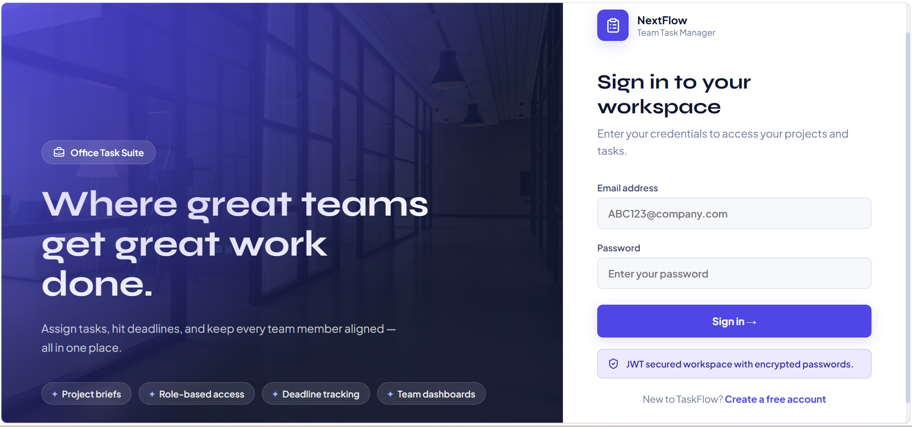
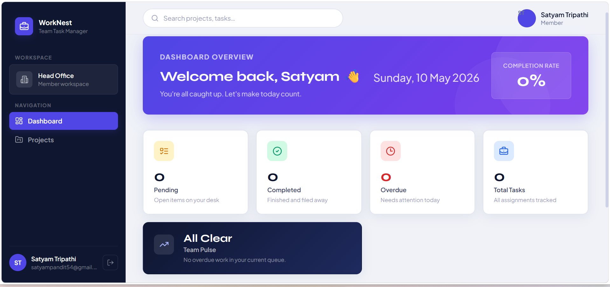
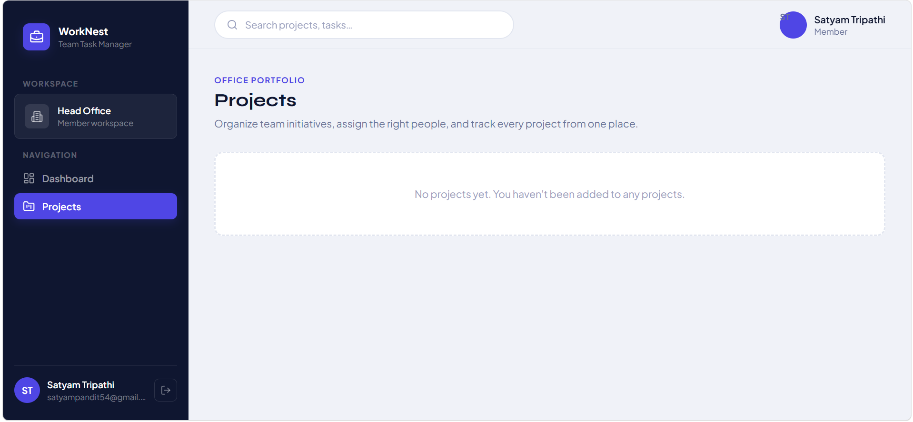

# 🗂️ WorkNest — Team Task Manager

> A full-stack MERN application to manage teams, projects, and tasks with role-based access control.

## 🚀 Live Preview

> [worknest-team-task-manager-production-b730.up.railway.app](https://worknest-team-task-manager-production-b730.up.railway.app/login)

---

## 📸 Screenshots

| Login Page | Dashboard | Projects |
|---|---|---|
|  |  |  |

---

## 🧠 What is WorkNest?

WorkNest is a productivity tool I built to practice full-stack development with the MERN stack. It lets teams organize their work through projects and tasks, with two roles — **Admin** and **Member** — each having different levels of access.

Admins can create projects, assign tasks, and manage the team. Members see only what's assigned to them and can update task statuses.

---

## ⚙️ Tech Stack

| Layer | Technology |
|---|---|
| Frontend | React 19, Vite, React Router v7 |
| Backend | Node.js, Express.js |
| Database | MongoDB with Mongoose |
| Auth | JWT (JSON Web Tokens) + bcryptjs |
| Icons | Lucide React |
| Fonts | Plus Jakarta Sans, Syne (Google Fonts) |

---

## ✨ Features

- 🔐 Signup & Login with JWT authentication
- 👑 Admin role — create/edit/delete projects and tasks, manage team members
- 👤 Member role — view assigned projects, update own task status
- 📊 Personal dashboard with pending, completed, and overdue task counts
- 📁 Project management with team member assignment
- ✅ Task tracking with due dates, descriptions, and status filters
- 🛡️ Protected API routes with middleware-based auth
- 💅 Clean, modern UI with dark sidebar and responsive layout

---

## 📁 Folder Structure

```
worknest/
├── backend/
│   └── src/
│       ├── config/        # MongoDB connection
│       ├── controllers/   # Route logic
│       ├── middleware/     # Auth, error handling, validation
│       ├── models/        # Mongoose schemas
│       ├── routes/        # Express routes
│       ├── utils/         # JWT helpers, AppError
│       ├── app.js
│       └── server.js
├── frontend/
│   └── src/
│       ├── api/           # Axios client
│       ├── components/    # Layout, TaskList, StatusBadge
│       ├── context/       # Auth context
│       ├── pages/         # Dashboard, Login, Signup, Projects
│       ├── App.jsx
│       ├── main.jsx
│       └── styles.css
├── .env.example
└── package.json
```

---

## 🛠️ Getting Started Locally

### Prerequisites

- Node.js v20+
- npm v10+
- MongoDB (local) or MongoDB Atlas account

---

### 1. Clone the repo

```bash
git clone https://github.com/satyamtripathii/WorkNest-Team-Task-Manager.git
cd WorkNest-Team-Task-Manager
```

### 2. Install dependencies

```bash
npm install --prefix backend
npm install --prefix frontend
```

### 3. Set up environment variables

Copy the example file and fill in your values:

```bash
copy backend\.env.example backend\.env
```

Edit `backend/.env`:

```env
NODE_ENV=development
PORT=5000
MONGO_URI=mongodb://127.0.0.1:27017/worknest
JWT_SECRET=your-super-secret-key-here
JWT_EXPIRES_IN=7d
CLIENT_URL=http://localhost:5173
```

### 4. Run the app

Open **two terminals**:

**Terminal 1 — Backend:**
```bash
npm run dev --prefix backend
```

**Terminal 2 — Frontend:**
```bash
npm run dev --prefix frontend
```

Then open: **http://localhost:5173**

---

## 🔑 API Overview

Base URL: `/api`

| Method | Endpoint | Access | Description |
|---|---|---|---|
| POST | `/auth/signup` | Public | Register a new user |
| POST | `/auth/login` | Public | Login and get JWT |
| GET | `/auth/me` | Auth | Get current user |
| GET | `/projects` | Auth | List projects |
| POST | `/projects` | Admin | Create project |
| PATCH | `/projects/:id` | Admin | Update project |
| DELETE | `/projects/:id` | Admin | Delete project |
| GET | `/projects/:id/tasks` | Auth | List tasks in project |
| POST | `/projects/:id/tasks` | Admin | Create task |
| PATCH | `/tasks/:id` | Auth | Update task |
| DELETE | `/tasks/:id` | Admin | Delete task |
| GET | `/tasks/my-dashboard` | Auth | Dashboard counts |
| GET | `/users` | Admin | List all users |

---

## 👥 Roles

| Role | What they can do |
|---|---|
| **Admin** | Create/edit/delete projects & tasks, manage team members, see all data |
| **Member** | View assigned projects & tasks, update status of own tasks only |

---

## 🤝 Author

**Satyam Tripathi**
- GitHub: [@satyamtripathii](https://github.com/satyamtripathii)

---

## 📄 License

This project is open source and available under the [MIT License](LICENSE).